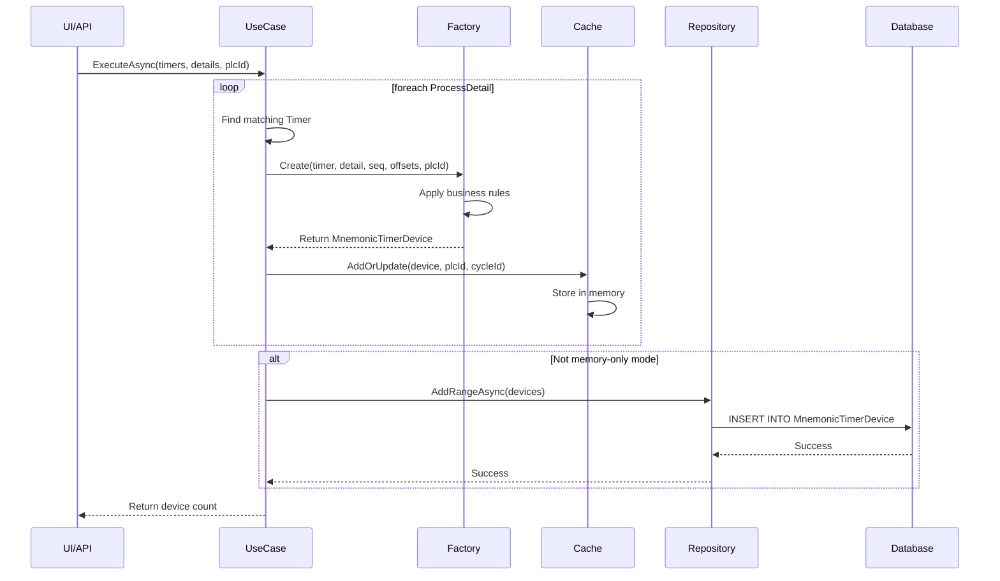

# MnemonicTimerDevice作成処理 - 5層アーキテクチャ モデルケース

## 概要

本ドキュメントは、`MnemonicTimerDevice`（ニモニックタイマーデバイス）の作成処理を5層アーキテクチャで実装したモデルケースです。
この実装は、クリーンアーキテクチャの原則に従い、各層の責務を明確に分離しています。

## 目次

1. [アーキテクチャ概要](#アーキテクチャ概要)
2. [処理フロー](#処理フロー)
3. [各層の実装詳細](#各層の実装詳細)
4. [データモデル](#データモデル)
5. [依存性注入の設定](#依存性注入の設定)
6. [エラーハンドリング](#エラーハンドリング)
7. [テスト戦略](#テスト戦略)
8. [マイグレーション戦略](#マイグレーション戦略)

## アーキテクチャ概要

### 層構造と責務

```
┌─────────────────────────────────────────────────────────┐
│  Presentation Layer                                      │
│  ├─ WPF: MainViewModel                                  │
│  └─ API: MnemonicTimerDeviceController                  │
└─────────────────────────────────────────────────────────┘
                            ↓
┌─────────────────────────────────────────────────────────┐
│  Application Layer                                       │
│  └─ SaveProcessDetailTimerDevicesUseCase                │
└─────────────────────────────────────────────────────────┘
                            ↓
┌─────────────────────────────────────────────────────────┐
│  Domain Layer                                            │
│  ├─ MnemonicTimerDeviceFactory                          │
│  ├─ IDeviceOffsetProvider                               │
│  ├─ ISequenceGenerator                                  │
│  └─ ITimerDeviceCache                                   │
└─────────────────────────────────────────────────────────┘
                            ↓
┌─────────────────────────────────────────────────────────┐
│  Infrastructure Layer                                    │
│  ├─ MnemonicTimerDeviceRepository                       │
│  ├─ TimerDeviceCache                                    │
│  ├─ DeviceOffsetProvider                                │
│  └─ SequenceGenerator                                   │
└─────────────────────────────────────────────────────────┘
                            ↓
┌─────────────────────────────────────────────────────────┐
│  Data Layer                                              │
│  └─ Access Database / PostgreSQL                        │
└─────────────────────────────────────────────────────────┘
```

## 処理フロー

### シーケンス図



### フローチャート

```mermaid
flowchart TD
    Start([開始]) --> Input[/Timers, ProcessDetails, PlcId/]
    Input --> InitList[devices = new List]
    
    InitList --> LoopStart{ProcessDetailごとにループ}
    LoopStart --> FindTimer[対応するTimerを検索]
    
    FindTimer --> TimerFound{Timer存在?}
    TimerFound -->|No| NextDetail[次のProcessDetail]
    TimerFound -->|Yes| GetSequence[連番を取得]
    
    GetSequence --> CheckCategory{TimerCategoryId?}
    CheckCategory -->|6 or 7| SetPrefixT[prefix = "T"]
    CheckCategory -->|その他| SetPrefixST[prefix = "ST"]
    
    SetPrefixT --> CreateDevice
    SetPrefixST --> CreateDevice[MnemonicTimerDevice作成]
    
    CreateDevice --> AddToList[リストに追加]
    AddToList --> SaveCache[キャッシュに保存]
    SaveCache --> NextDetail
    
    NextDetail --> LoopStart
    LoopStart -->|ループ終了| CheckMode{メモリオンリー?}
    
    CheckMode -->|Yes| ReturnCount[デバイス数を返す]
    CheckMode -->|No| SaveDB[データベースに保存]
    SaveDB --> ReturnCount
    
    ReturnCount --> End([終了])
```

## 各層の実装詳細

### 1. Presentation層

#### WPF ViewModel実装
```csharp
// KdxDesigner/ViewModels/MainViewModelExtended.cs
public partial class MainViewModel
{
    private SaveProcessDetailTimerDevicesUseCase? _saveTimerDevicesUseCase;

    public async Task SaveTimerDevicesAsync()
    {
        // レガシーコードとの互換性を保持
        if (_saveTimerDevicesUseCase == null)
        {
            SaveTimerDevicesLegacy();
            return;
        }

        // データ取得
        var timer = _repository!.GetTimers();
        var details = _repository.GetProcessDetails();
        
        // 新しいユースケースを使用
        await _saveTimerDevicesUseCase.ExecuteAsync(
            timer, 
            details, 
            SelectedPlc!.Id);
    }
}
```

#### Web API Controller実装
```csharp
// KdxMigrationAPI/Controllers/MnemonicTimerDeviceController.cs
[ApiController]
[Route("api/[controller]")]
public class MnemonicTimerDeviceController : ControllerBase
{
    private readonly SaveProcessDetailTimerDevicesUseCase _useCase;

    [HttpPost("save-process-detail-timers")]
    public async Task<IActionResult> SaveProcessDetailTimers(
        [FromBody] SaveTimerDevicesRequest request)
    {
        try
        {
            var result = await _useCase.ExecuteAsync(
                request.Timers,
                request.Details,
                request.PlcId);

            return Ok(new SaveTimerDevicesResponse
            {
                Success = true,
                DeviceCount = result,
                Message = $"Successfully saved {result} timer devices"
            });
        }
        catch (Exception ex)
        {
            _logger.LogError(ex, "Error saving timer devices");
            return StatusCode(500, new SaveTimerDevicesResponse
            {
                Success = false,
                DeviceCount = 0,
                Message = $"Error: {ex.Message}"
            });
        }
    }
}
```

### 2. Application層

#### ユースケース実装
```csharp
// Kdx.Core/Application/SaveProcessDetailTimerDevicesUseCase.cs
public sealed class SaveProcessDetailTimerDevicesUseCase
{
    private readonly IMnemonicTimerDeviceRepository _repo;
    private readonly ITimerDeviceCache _cache;
    private readonly ISequenceGenerator _seq;
    private readonly IDeviceOffsetProvider _offsets;
    private readonly bool _useCacheOnly;

    public async Task<int> ExecuteAsync(
        IReadOnlyList<Timer> timers,
        IReadOnlyList<ProcessDetail> details,
        int plcId,
        CancellationToken ct = default)
    {
        var devices = new List<MnemonicTimerDevice>();

        foreach (var detail in details)
        {
            // ビジネスルール: ProcessDetailに対応するTimerを検索
            var timer = timers.FirstOrDefault(t =>
                t.MnemonicId == (int)MnemonicType.ProcessDetail &&
                t.CycleId == detail.CycleId);

            if (timer is null) continue;

            // ドメインファクトリーを使用してエンティティ作成
            var device = MnemonicTimerDeviceFactory.Create(
                timer, detail, _seq.Next(), _offsets, plcId);

            devices.Add(device);
            
            // キャッシュに保存（高速アクセス用）
            _cache.AddOrUpdate(device, plcId, timer.CycleId ?? 1);
        }

        // 永続化（オプション）
        if (!_useCacheOnly && devices.Count > 0)
        {
            await _repo.AddRangeAsync(devices, ct);
        }

        return devices.Count;
    }
}
```

### 3. Domain層

#### ファクトリー実装
```csharp
// Kdx.Core/Domain/Factories/MnemonicTimerDeviceFactory.cs
public static class MnemonicTimerDeviceFactory
{
    public static MnemonicTimerDevice Create(
        Timer timer, 
        ProcessDetail detail, 
        int sequenceBase,
        IDeviceOffsetProvider offsets, 
        int plcId)
    {
        // ビジネスルール: TimerCategoryIdによるプレフィックス決定
        // 6: 異常時BK (EBT)
        // 7: 正常時BK (NBT)
        var prefix = (timer.TimerCategoryId is 6 or 7) ? "T" : "ST";
        
        // デバイス番号の生成
        var processTimerDevice = $"{prefix}{sequenceBase + offsets.DeviceStartT}";
        var timerDevice = $"ZR{timer.TimerNum + offsets.TimerStartZR}";

        return new MnemonicTimerDevice
        {
            MnemonicId = (int)MnemonicType.ProcessDetail,
            RecordId = detail.Id,
            TimerId = timer.ID,
            TimerCategoryId = timer.TimerCategoryId,
            ProcessTimerDevice = processTimerDevice,
            TimerDevice = timerDevice,
            PlcId = plcId,
            CycleId = timer.CycleId,
            Comment1 = timer.TimerName
        };
    }
}
```

#### ドメインインターフェース
```csharp
// Kdx.Core/Domain/Services/DeviceOffsets.cs
public interface IDeviceOffsetProvider
{
    int DeviceStartT { get; }    // ST/T デバイスの開始番号
    int TimerStartZR { get; }    // ZR デバイスのオフセット
}

public interface ISequenceGenerator
{
    int Next();  // 連番採番
}

public interface ITimerDeviceCache
{
    void AddOrUpdate(MnemonicTimerDevice device, int plcId, int cycleId);
}

public interface IMnemonicTimerDeviceRepository
{
    Task AddRangeAsync(IEnumerable<MnemonicTimerDevice> devices, CancellationToken ct);
}
```

### 4. Infrastructure層

#### リポジトリ実装
```csharp
// Kdx.Infrastructure/Repositories/MnemonicTimerDeviceRepository.cs
public sealed class MnemonicTimerDeviceRepository : IMnemonicTimerDeviceRepository
{
    private readonly IAccessRepository _accessRepository;
    private readonly string _connectionString;

    public async Task AddRangeAsync(
        IEnumerable<MnemonicTimerDevice> devices, 
        CancellationToken ct)
    {
        using var connection = new OleDbConnection(_connectionString);
        await connection.OpenAsync(ct);
        
        using var transaction = connection.BeginTransaction();
        try
        {
            const string sql = @"
                INSERT INTO MnemonicTimerDevice (
                    MnemonicId, RecordId, TimerId, TimerCategoryId,
                    ProcessTimerDevice, TimerDevice, PlcId, CycleId, Comment1
                ) VALUES (
                    @MnemonicId, @RecordId, @TimerId, @TimerCategoryId,
                    @ProcessTimerDevice, @TimerDevice, @PlcId, @CycleId, @Comment1
                )";

            foreach (var device in devices)
            {
                await connection.ExecuteAsync(sql, device, transaction);
                if (ct.IsCancellationRequested)
                {
                    transaction.Rollback();
                    ct.ThrowIfCancellationRequested();
                }
            }

            transaction.Commit();
        }
        catch
        {
            transaction.Rollback();
            throw;
        }
    }
}
```

#### キャッシュ実装
```csharp
// Kdx.Infrastructure/Cache/TimerDeviceCache.cs
public sealed class TimerDeviceCache : ITimerDeviceCache
{
    private readonly object _lock = new object();
    private readonly Dictionary<int, Dictionary<int, List<MnemonicTimerDevice>>> _timerDevices;

    public void AddOrUpdate(MnemonicTimerDevice device, int plcId, int cycleId)
    {
        lock (_lock)
        {
            // 3階層の辞書構造: PlcId -> CycleId -> List<Device>
            if (!_timerDevices.ContainsKey(plcId))
            {
                _timerDevices[plcId] = new Dictionary<int, List<MnemonicTimerDevice>>();
            }

            if (!_timerDevices[plcId].ContainsKey(cycleId))
            {
                _timerDevices[plcId][cycleId] = new List<MnemonicTimerDevice>();
            }

            // 複合キーで既存デバイスを検索
            var existingIndex = _timerDevices[plcId][cycleId].FindIndex(d =>
                d.MnemonicId == device.MnemonicId &&
                d.RecordId == device.RecordId &&
                d.TimerId == device.TimerId);

            if (existingIndex >= 0)
            {
                _timerDevices[plcId][cycleId][existingIndex] = device;
            }
            else
            {
                _timerDevices[plcId][cycleId].Add(device);
            }
        }
    }
}
```

## データモデル

### エンティティ定義
```csharp
// Kdx.Contracts/DTOs/MnemonicTimerDevice.cs
[Table("MnemonicTimerDevice", Schema = "dbo")]
public class MnemonicTimerDevice
{
    [Key, Column(Order = 0)]
    public int MnemonicId { get; set; }        // 1:Process, 2:ProcessDetail, 3:Operation, 4:CY
    
    [Key, Column(Order = 1)]
    public int RecordId { get; set; }          // 対応するテーブルのレコードID
    
    [Key, Column(Order = 2)]
    public int TimerId { get; set; }           // TimerテーブルのID
    
    public int? TimerCategoryId { get; set; }  // タイマーカテゴリー
    public string ProcessTimerDevice { get; set; } = "T0";   // プロセスタイマーデバイス
    public string TimerDevice { get; set; } = "ZR0";         // 外部タイマーデバイス
    public int PlcId { get; set; }             // PLC識別子
    public int? CycleId { get; set; }          // サイクル識別子
    public string? Comment1 { get; set; }      // コメント
}
```

### データベーススキーマ
```sql
CREATE TABLE MnemonicTimerDevice (
    MnemonicId INT NOT NULL,
    RecordId INT NOT NULL,
    TimerId INT NOT NULL,
    TimerCategoryId INT NULL,
    ProcessTimerDevice VARCHAR(10) NOT NULL,
    TimerDevice VARCHAR(10) NOT NULL,
    PlcId INT NOT NULL,
    CycleId INT NULL,
    Comment1 VARCHAR(255) NULL,
    Comment2 VARCHAR(255) NULL,
    Comment3 VARCHAR(255) NULL,
    
    PRIMARY KEY (MnemonicId, RecordId, TimerId)
);
```

## 依存性注入の設定

### WPFアプリケーション
```csharp
// KdxDesigner/Extensions/ServiceCollectionExtensions.cs
public static IServiceCollection AddKdxCoreServices(
    this IServiceCollection services,
    IConfiguration configuration)
{
    // Options
    services.Configure<DeviceOffsetOptions>(options =>
    {
        options.DeviceStartT = configuration.GetValue<int>("DeviceOffsets:DeviceStartT", 0);
        options.TimerStartZR = configuration.GetValue<int>("DeviceOffsets:TimerStartZR", 0);
    });

    // Domain Services
    services.AddSingleton<IDeviceOffsetProvider, DeviceOffsetProvider>();
    services.AddSingleton<ISequenceGenerator, SequenceGenerator>();
    
    // Infrastructure
    services.AddSingleton<ITimerDeviceCache, TimerDeviceCache>();
    services.AddScoped<IMnemonicTimerDeviceRepository, MnemonicTimerDeviceRepository>();
    
    // Application Use Cases
    services.AddScoped<SaveProcessDetailTimerDevicesUseCase>();

    return services;
}
```

### Web API
```csharp
// KdxMigrationAPI/Program.cs
var builder = WebApplication.CreateBuilder(args);

// 5層アーキテクチャのサービス登録
builder.Services.Configure<DeviceOffsetOptions>(options =>
{
    options.DeviceStartT = builder.Configuration.GetValue<int>("DeviceOffsets:DeviceStartT", 0);
    options.TimerStartZR = builder.Configuration.GetValue<int>("DeviceOffsets:TimerStartZR", 0);
});

builder.Services.AddSingleton<IDeviceOffsetProvider, DeviceOffsetProvider>();
builder.Services.AddSingleton<ISequenceGenerator, SequenceGenerator>();
builder.Services.AddSingleton<IMnemonicDeviceMemoryStore, MnemonicDeviceMemoryStore>();
builder.Services.AddSingleton<ITimerDeviceCache, TimerDeviceCache>();
builder.Services.AddScoped<IMnemonicTimerDeviceRepository, MnemonicTimerDeviceRepository>();
builder.Services.AddScoped<SaveProcessDetailTimerDevicesUseCase>();
```

### 設定ファイル
```json
// appsettings.json
{
  "DeviceOffsets": {
    "DeviceStartT": 0,    // ST/T デバイスの開始番号
    "TimerStartZR": 0     // ZR デバイスのオフセット値
  },
  "ConnectionStrings": {
    "AccessConnection": "Provider=Microsoft.ACE.OLEDB.12.0;Data Source=..."
  }
}
```

## エラーハンドリング

### Application層でのエラーハンドリング
```csharp
public class TimerDeviceService : ITimerDeviceService
{
    public async Task<SaveTimerDevicesResult> SaveProcessDetailTimersAsync(
        List<Timer> timers, 
        List<ProcessDetail> details, 
        int plcId)
    {
        try
        {
            // ビジネスルールの検証
            var validationErrors = ValidateInput(timers, details);
            if (validationErrors.Any())
            {
                return new SaveTimerDevicesResult
                {
                    Success = false,
                    Errors = validationErrors
                };
            }
            
            // ユースケース実行
            var deviceCount = await _saveUseCase.ExecuteAsync(
                timers, details, plcId);
            
            return new SaveTimerDevicesResult
            {
                Success = true,
                DeviceCount = deviceCount,
                Message = $"Successfully saved {deviceCount} timer devices"
            };
        }
        catch (Exception ex)
        {
            _logger.LogError(ex, "Error saving timer devices for PLC {PlcId}", plcId);
            
            return new SaveTimerDevicesResult
            {
                Success = false,
                Errors = new[] { ex.Message }
            };
        }
    }

    private List<string> ValidateInput(List<Timer> timers, List<ProcessDetail> details)
    {
        var errors = new List<string>();

        if (timers == null || !timers.Any())
            errors.Add("Timers list is empty or null");

        if (details == null || !details.Any())
            errors.Add("ProcessDetails list is empty or null");

        // TimerCategoryIdの範囲チェック
        var invalidTimers = timers?
            .Where(t => t.TimerCategoryId < 0 || t.TimerCategoryId > 10)
            .ToList();
        
        if (invalidTimers?.Any() == true)
        {
            errors.Add($"Invalid timer categories found: {string.Join(", ", 
                invalidTimers.Select(t => t.TimerCategoryId).Distinct())}");
        }

        return errors;
    }
}
```

## テスト戦略

### 単体テスト例

#### Domain層テスト
```csharp
[TestClass]
public class MnemonicTimerDeviceFactoryTests
{
    [TestMethod]
    public void Create_WithEBTCategory_UsesTPrefix()
    {
        // Arrange
        var timer = new Timer { TimerCategoryId = 6, TimerNum = 100 };
        var detail = new ProcessDetail { Id = 1, CycleId = 1 };
        var offsets = new Mock<IDeviceOffsetProvider>();
        offsets.Setup(x => x.DeviceStartT).Returns(0);
        offsets.Setup(x => x.TimerStartZR).Returns(0);

        // Act
        var device = MnemonicTimerDeviceFactory.Create(
            timer, detail, 0, offsets.Object, 1);

        // Assert
        Assert.IsTrue(device.ProcessTimerDevice.StartsWith("T"));
    }

    [TestMethod]
    public void Create_WithNormalCategory_UsesSTPrefix()
    {
        // Arrange
        var timer = new Timer { TimerCategoryId = 1, TimerNum = 100 };
        var detail = new ProcessDetail { Id = 1, CycleId = 1 };
        var offsets = new Mock<IDeviceOffsetProvider>();
        offsets.Setup(x => x.DeviceStartT).Returns(0);
        offsets.Setup(x => x.TimerStartZR).Returns(0);

        // Act
        var device = MnemonicTimerDeviceFactory.Create(
            timer, detail, 0, offsets.Object, 1);

        // Assert
        Assert.IsTrue(device.ProcessTimerDevice.StartsWith("ST"));
    }
}
```

#### Application層テスト
```csharp
[TestClass]
public class SaveProcessDetailTimerDevicesUseCaseTests
{
    private Mock<IMnemonicTimerDeviceRepository> _repoMock;
    private Mock<ITimerDeviceCache> _cacheMock;
    private Mock<ISequenceGenerator> _seqMock;
    private Mock<IDeviceOffsetProvider> _offsetsMock;
    private SaveProcessDetailTimerDevicesUseCase _useCase;

    [TestInitialize]
    public void Setup()
    {
        _repoMock = new Mock<IMnemonicTimerDeviceRepository>();
        _cacheMock = new Mock<ITimerDeviceCache>();
        _seqMock = new Mock<ISequenceGenerator>();
        _offsetsMock = new Mock<IDeviceOffsetProvider>();
        
        _useCase = new SaveProcessDetailTimerDevicesUseCase(
            _repoMock.Object,
            _cacheMock.Object,
            _seqMock.Object,
            _offsetsMock.Object,
            useCacheOnly: false);
    }

    [TestMethod]
    public async Task ExecuteAsync_WithMatchingTimers_CreatesDevices()
    {
        // Arrange
        var timers = new List<Timer>
        {
            new Timer { ID = 1, MnemonicId = 2, CycleId = 1 }
        };
        var details = new List<ProcessDetail>
        {
            new ProcessDetail { Id = 1, CycleId = 1 }
        };

        _seqMock.Setup(x => x.Next()).Returns(100);
        _offsetsMock.Setup(x => x.DeviceStartT).Returns(0);
        _offsetsMock.Setup(x => x.TimerStartZR).Returns(0);

        // Act
        var result = await _useCase.ExecuteAsync(timers, details, 1);

        // Assert
        Assert.AreEqual(1, result);
        _cacheMock.Verify(x => x.AddOrUpdate(It.IsAny<MnemonicTimerDevice>(), 1, 1), Times.Once);
        _repoMock.Verify(x => x.AddRangeAsync(It.IsAny<IEnumerable<MnemonicTimerDevice>>(), 
            It.IsAny<CancellationToken>()), Times.Once);
    }
}
```

## マイグレーション戦略

### 段階的移行アプローチ

#### Phase 1: 並行実行（現在）
```csharp
public async Task SaveTimerDevicesAsync()
{
    if (_saveTimerDevicesUseCase == null)
    {
        // レガシーコードを実行
        SaveTimerDevicesLegacy();
        return;
    }
    
    // 新しいユースケースを実行
    await _saveTimerDevicesUseCase.ExecuteAsync(...);
}
```

#### Phase 2: 機能フラグによる切り替え
```csharp
public async Task SaveTimerDevicesAsync()
{
    if (FeatureFlags.UseNewArchitecture)
    {
        await _saveTimerDevicesUseCase.ExecuteAsync(...);
    }
    else
    {
        SaveTimerDevicesLegacy();
    }
}
```

#### Phase 3: 完全移行
```csharp
public async Task SaveTimerDevicesAsync()
{
    // レガシーコードを削除
    await _saveTimerDevicesUseCase.ExecuteAsync(...);
}
```

## パフォーマンス最適化

### 1. バッチ処理
```csharp
// 一括挿入による高速化
public async Task AddRangeAsync(IEnumerable<MnemonicTimerDevice> devices, CancellationToken ct)
{
    // バルクインサートの実装
    using var bulkCopy = new SqlBulkCopy(_connectionString);
    bulkCopy.DestinationTableName = "MnemonicTimerDevice";
    
    var dataTable = ConvertToDataTable(devices);
    await bulkCopy.WriteToServerAsync(dataTable, ct);
}
```

### 2. キャッシュ戦略
```csharp
public class TimerDeviceCache : ITimerDeviceCache
{
    private readonly MemoryCache _cache;
    
    public TimerDeviceCache()
    {
        var options = new MemoryCacheOptions
        {
            SizeLimit = 10000,
            ExpirationScanFrequency = TimeSpan.FromMinutes(5)
        };
        _cache = new MemoryCache(options);
    }
    
    public void AddOrUpdate(MnemonicTimerDevice device, int plcId, int cycleId)
    {
        var key = $"{plcId}:{cycleId}:{device.MnemonicId}:{device.RecordId}:{device.TimerId}";
        
        var cacheEntryOptions = new MemoryCacheEntryOptions()
            .SetSlidingExpiration(TimeSpan.FromMinutes(15))
            .SetSize(1);
            
        _cache.Set(key, device, cacheEntryOptions);
    }
}
```

## モニタリングとログ

### ロギング実装
```csharp
public class SaveProcessDetailTimerDevicesUseCase
{
    private readonly ILogger<SaveProcessDetailTimerDevicesUseCase> _logger;
    
    public async Task<int> ExecuteAsync(...)
    {
        using var activity = Activity.StartActivity("SaveTimerDevices");
        activity?.SetTag("plc.id", plcId);
        activity?.SetTag("details.count", details.Count);
        
        _logger.LogInformation(
            "Starting timer device creation for PLC {PlcId} with {DetailCount} details",
            plcId, details.Count);
        
        try
        {
            // 処理実行
            var devices = CreateDevices(timers, details, plcId);
            
            _logger.LogInformation(
                "Created {DeviceCount} timer devices for PLC {PlcId}",
                devices.Count, plcId);
            
            return devices.Count;
        }
        catch (Exception ex)
        {
            _logger.LogError(ex,
                "Failed to create timer devices for PLC {PlcId}",
                plcId);
            throw;
        }
    }
}
```

## まとめ

このモデルケースは、5層アーキテクチャの原則に従った実装例として以下の特徴を持ちます：

### 利点
1. **関心の分離**: 各層が明確な責務を持つ
2. **テスタビリティ**: モックを使用した単体テストが容易
3. **保守性**: 変更の影響範囲が限定的
4. **拡張性**: 新機能の追加が既存コードに影響しない
5. **段階的移行**: レガシーコードとの共存が可能

### 適用シーン
- 複雑なビジネスロジックを持つエンタープライズアプリケーション
- 長期的な保守が必要なシステム
- 複数のクライアント（WPF、Web API）を持つアプリケーション
- チーム開発において責務を明確に分けたい場合

### 注意点
- 小規模なアプリケーションには過剰な場合がある
- 初期実装コストが高い
- チーム全体での理解が必要

この実装パターンを他の機能にも適用することで、一貫性のある保守しやすいシステムを構築できます。