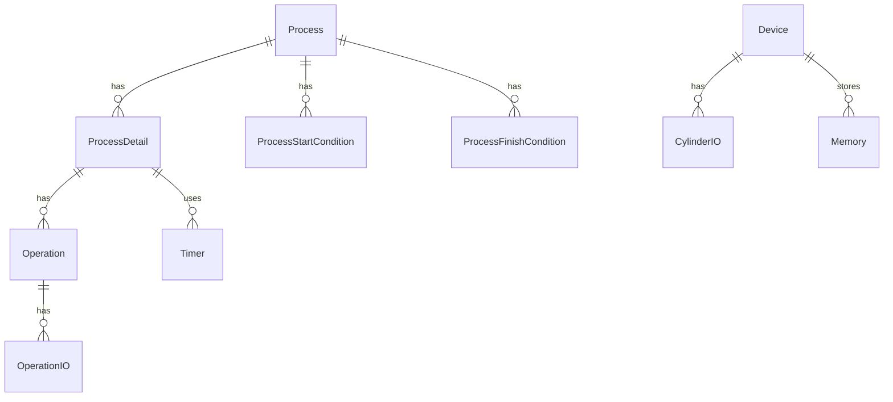
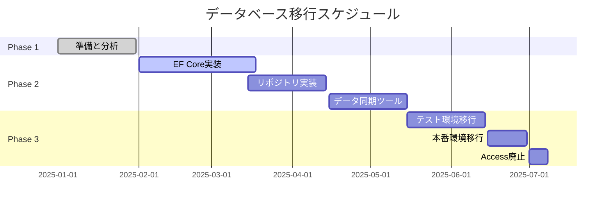

# データベース移行戦略

## 概要

KDX Projectsは、レガシーなMicrosoft AccessデータベースからモダンなRDBMS（PostgreSQL/SQL Server）への段階的な移行を計画しています。この文書では、移行戦略、実装計画、および移行中の互換性維持について説明します。

## 現状の課題

### Microsoft Accessの制限

1. **スケーラビリティ**
   - 同時接続数の制限（最大255接続）
   - ファイルサイズ制限（2GB）
   - パフォーマンスの低下

2. **運用面**
   - バックアップ・リストアの複雑さ
   - ネットワーク共有での同時アクセス問題
   - トランザクション管理の制限

3. **開発面**
   - 限定的なSQL機能
   - ストアドプロシージャの欠如
   - 外部ツールとの統合困難

## 移行アーキテクチャ

```
現在（Phase 0）:
┌──────────────┐
│ KdxDesigner  │
│    (WPF)     │
└──────┬───────┘
       │ OleDb
       ▼
┌──────────────┐
│ Access DB    │
│   (.mdb)     │
└──────────────┘

移行後（Phase 3）:
┌──────────────┐
│ KdxDesigner  │
│    (WPF)     │
└──────┬───────┘
       │ API
       ▼
┌──────────────┐
│   Kdx.API    │
└──────┬───────┘
       │ EF Core
       ▼
┌──────────────┐
│ PostgreSQL/  │
│ SQL Server   │
└──────────────┘
```

## 移行フェーズ

### Phase 1: 準備と分析（完了）

**実施内容:**
- ✅ 27個のAccessテーブルをDTOとして定義
- ✅ Kdx.Contractsプロジェクトへの移動
- ✅ データ構造の文書化

**移動済みテーブル一覧:**
```
基本エンティティ:
- Process（工程）
- ProcessDetail（工程詳細）
- ProcessCategory（工程カテゴリ）
- ProcessStartCondition（開始条件）
- ProcessFinishCondition（終了条件）

操作関連:
- Operation（操作）
- OperationBlock（操作ブロック）
- OperationIO（操作IO）

デバイス関連:
- Device（デバイス）
- CylinderIO（シリンダーIO）
- DriveMain（メインドライブ）
- DriveSub（サブドライブ）
- Servo（サーボ）
- Sensor（センサー）

メモリ・タイマー関連:
- Memory（メモリ）
- MemoryCategory（メモリカテゴリ）
- Timer（タイマー）
- TimerRecordId（タイマーレコードID）

その他:
- Error（エラー）
- ErrorMessage（エラーメッセージ）
- IOHistory（IO履歴）
- Length（長さ）
- Model（モデル）
- ProsTime（処理時間）
- ProsTimeDefinitions（処理時間定義）
```

### Phase 2: デュアルデータベース対応（進行中）

**目標:** AccessとPostgreSQL/SQL Serverの並行運用

**実装計画:**

1. **Entity Framework Core設定**
```csharp
// Kdx.Infrastructure/Data/KdxDbContext.cs
public class KdxDbContext : DbContext
{
    public DbSet<Process> Processes { get; set; }
    public DbSet<ProcessDetail> ProcessDetails { get; set; }
    // ... 他のエンティティ
    
    protected override void OnModelCreating(ModelBuilder modelBuilder)
    {
        // 複合キーの設定
        modelBuilder.Entity<CylinderIO>()
            .HasKey(c => new { c.Address, c.PlcId });
            
        // インデックスの設定
        modelBuilder.Entity<Process>()
            .HasIndex(p => p.PlcId);
    }
}
```

2. **リポジトリパターンの実装**
```csharp
// 抽象化されたリポジトリインターフェース
public interface IProcessRepository
{
    Task<Process> GetByIdAsync(int id);
    Task<IEnumerable<Process>> GetAllAsync();
    Task<int> CreateAsync(Process process);
    Task UpdateAsync(Process process);
    Task DeleteAsync(int id);
}

// PostgreSQL/SQL Server実装
public class SqlProcessRepository : IProcessRepository
{
    private readonly KdxDbContext _context;
    // EF Core実装
}

// Access互換実装（移行期間用）
public class AccessProcessRepository : IProcessRepository
{
    private readonly string _connectionString;
    // Dapper + OleDb実装
}
```

3. **データ同期サービス**
```csharp
public class DataSyncService
{
    public async Task SyncFromAccessToSql()
    {
        // Accessからデータ読み込み
        // SQL Serverへ書き込み
        // 整合性チェック
    }
}
```

### Phase 3: 完全移行

**目標:** PostgreSQL/SQL Serverへの完全移行

**実施内容:**
- Accessデータベースの廃止
- パフォーマンスチューニング
- バックアップ・リストア手順の確立

## データベーススキーマ設計

### 主要テーブルの関係



### インデックス戦略

```sql
-- 頻繁に検索されるカラムにインデックス
CREATE INDEX idx_process_plcid ON Process(PlcId);
CREATE INDEX idx_processdetail_processid ON ProcessDetail(ProcessId);
CREATE INDEX idx_memory_plcid_device ON Memory(PlcId, Device);

-- 複合キーのパフォーマンス最適化
CREATE UNIQUE INDEX idx_cylinderio_composite ON CylinderIO(Address, PlcId);
```

## 移行ツール

### 1. データ移行スクリプト

```csharp
// Kdx.Infrastructure/Migration/AccessToSqlMigrator.cs
public class AccessToSqlMigrator
{
    private readonly string _accessConnString;
    private readonly KdxDbContext _sqlContext;
    
    public async Task MigrateProcesses()
    {
        using var accessConn = new OleDbConnection(_accessConnString);
        var processes = await accessConn.QueryAsync<Process>(
            "SELECT * FROM Process"
        );
        
        foreach (var process in processes)
        {
            _sqlContext.Processes.Add(process);
        }
        
        await _sqlContext.SaveChangesAsync();
    }
}
```

### 2. データ検証ツール

```csharp
public class DataValidator
{
    public async Task<ValidationResult> ValidateMigration()
    {
        var result = new ValidationResult();
        
        // レコード数の比較
        result.ProcessCount = await CompareRecordCounts("Process");
        
        // データ整合性チェック
        result.IntegrityCheck = await CheckReferentialIntegrity();
        
        // パフォーマンス比較
        result.PerformanceMetrics = await MeasureQueryPerformance();
        
        return result;
    }
}
```

## 互換性維持戦略

### 1. 接続文字列の動的切り替え

```json
// appsettings.json
{
  "ConnectionStrings": {
    "AccessConnection": "Provider=Microsoft.ACE.OLEDB.12.0;Data Source=kdx.mdb",
    "SqlConnection": "Host=localhost;Database=kdx_database;Username=kdx_user"
  },
  "DatabaseProvider": "PostgreSQL" // または "Access"
}
```

### 2. ファクトリーパターンによる実装切り替え

```csharp
public class RepositoryFactory
{
    private readonly IConfiguration _configuration;
    
    public IProcessRepository CreateProcessRepository()
    {
        var provider = _configuration["DatabaseProvider"];
        
        return provider switch
        {
            "PostgreSQL" => new SqlProcessRepository(_configuration),
            "Access" => new AccessProcessRepository(_configuration),
            _ => throw new NotSupportedException($"Provider {provider} not supported")
        };
    }
}
```

## パフォーマンス最適化

### 1. クエリ最適化

**Access（現在）:**
```sql
SELECT * FROM Process 
WHERE PlcId = ? 
ORDER BY ProcessName
```

**PostgreSQL（移行後）:**
```sql
SELECT p.*, COUNT(pd.Id) as DetailCount
FROM Process p
LEFT JOIN ProcessDetail pd ON p.Id = pd.ProcessId
WHERE p.PlcId = @PlcId
GROUP BY p.Id
ORDER BY p.ProcessName
```

### 2. バッチ処理の実装

```csharp
public async Task BulkInsertMemories(List<Memory> memories)
{
    const int batchSize = 1000;
    
    for (int i = 0; i < memories.Count; i += batchSize)
    {
        var batch = memories.Skip(i).Take(batchSize);
        
        using var transaction = await _context.Database.BeginTransactionAsync();
        _context.Memories.AddRange(batch);
        await _context.SaveChangesAsync();
        await transaction.CommitAsync();
    }
}
```

## 移行チェックリスト

### 事前準備
- [ ] 現在のAccessデータベースの完全バックアップ
- [ ] データ辞書の作成
- [ ] 外部キー関係の文書化
- [ ] ビジネスルールの確認

### 移行実施
- [ ] 開発環境でのテスト移行
- [ ] データ整合性の検証
- [ ] パフォーマンステスト
- [ ] ユーザー受け入れテスト

### 移行後
- [ ] 監視とログの設定
- [ ] バックアップスケジュールの設定
- [ ] パフォーマンスベースラインの確立
- [ ] ドキュメントの更新

## リスクと軽減策

| リスク | 影響 | 軽減策 |
|-------|------|--------|
| データ損失 | 高 | 複数バックアップ、段階的移行 |
| ダウンタイム | 中 | デュアル運用期間の設定 |
| パフォーマンス低下 | 中 | 事前のパフォーマンステスト |
| 互換性問題 | 低 | 抽象化層の実装 |

## 移行スケジュール案



## サポートツール

### 移行状況モニタリング

```csharp
public class MigrationMonitor
{
    public async Task<MigrationStatus> GetStatus()
    {
        return new MigrationStatus
        {
            TablesComplete = 27,
            TablesTotal = 27,
            RecordsMigrated = await GetMigratedRecordCount(),
            RecordsTotal = await GetTotalRecordCount(),
            LastSyncTime = DateTime.Now
        };
    }
}
```

### ロールバック手順

1. SQLデータベースの停止
2. Accessデータベースの復元
3. 接続文字列の切り替え
4. アプリケーション再起動

---
*次へ: [API統合](API-Integration.md)*