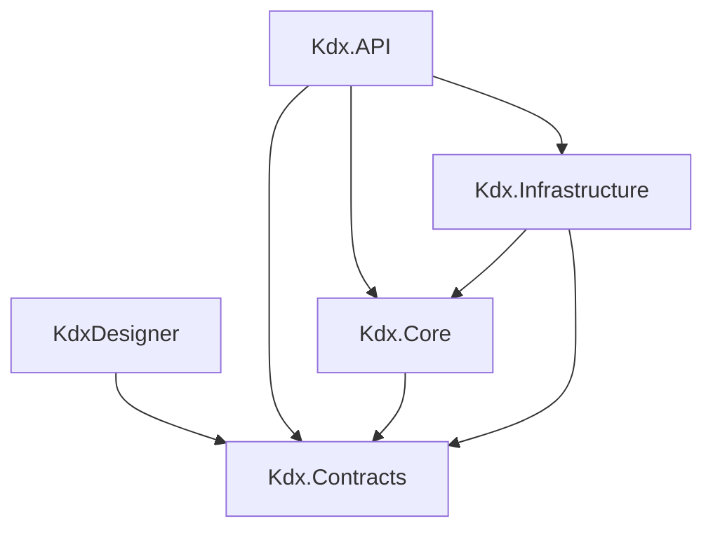

# プロジェクト構成

## ソリューション構造

```
KDX_Projects/
├── KDX_Projects.sln                 # ソリューションファイル
├── global.json                      # .NET SDK バージョン固定
├── docker-compose.yml               # Docker構成
├── .gitignore                      # Git除外設定
│
├── KdxDesigner/                    # WPFデスクトップアプリケーション
├── Kdx.API/                        # Web API プロジェクト
├── Kdx.Contracts/                  # 共有契約プロジェクト
├── Kdx.Core/                       # ビジネスロジック
├── Kdx.Infrastructure/             # インフラストラクチャ
│
├── docs/                           # ドキュメント
└── wiki/                           # GitHub Wiki コンテンツ
```

## 各プロジェクトの詳細

### 1. KdxDesigner (Presentation Layer)

**プロジェクトタイプ:** WPF Application (.NET 8.0)

**目的:** PLCプログラム設計のためのデスクトップアプリケーション

**ディレクトリ構造:**
```
KdxDesigner/
├── KdxDesigner.csproj              # プロジェクトファイル
├── App.xaml                        # アプリケーションエントリポイント
├── App.xaml.cs                     # アプリケーション初期化
├── CLAUDE.md                       # AI開発ガイドライン
│
├── Views/                          # WPFビュー (XAML)
│   ├── MainView.xaml              # メインウィンドウ
│   ├── ProcessEditView.xaml      # プロセス編集画面
│   ├── MemoryEditView.xaml       # メモリ編集画面
│   └── ...
│
├── ViewModels/                     # MVVM ViewModels
│   ├── MainViewModel.cs           # メインビューモデル
│   ├── ProcessViewModel.cs       # プロセスビューモデル
│   └── ...
│
├── Models/                         # ローカルモデル（レガシー）
│   ├── MnemonicDevice.cs         # ニーモニックデバイス
│   ├── MnemonicTimerDevice.cs    # タイマーデバイス
│   └── ...
│
├── Services/                       # ビジネスサービス（レガシー）
│   ├── Access/                   # Accessデータベースアクセス
│   ├── Memory/                   # メモリ管理
│   ├── Device/                   # デバイス管理
│   └── ...
│
├── ApiClients/                     # NSwag生成APIクライアント
│   └── KdxApiClient.cs           # 自動生成クライアント
│
└── Resources/                      # リソースファイル
    ├── Images/                    # アイコン、画像
    └── Styles/                    # XAMLスタイル
```

**主要な依存関係:**
```xml
<PackageReference Include="CommunityToolkit.Mvvm" Version="8.4.0" />
<PackageReference Include="Microsoft.Extensions.DependencyInjection" Version="9.0.0" />
<PackageReference Include="System.Data.OleDb" Version="9.0.4" />
<PackageReference Include="Dapper" Version="2.1.66" />
<PackageReference Include="NSwag.ApiDescription.Client" Version="14.1.0" />
```

### 2. Kdx.API (API Layer)

**プロジェクトタイプ:** ASP.NET Core Web API (.NET 8.0)

**目的:** RESTful APIサービスの提供

**ディレクトリ構造:**
```
Kdx.API/
├── Kdx.API.csproj                  # プロジェクトファイル
├── Program.cs                      # アプリケーションエントリポイント
├── appsettings.json               # 設定ファイル
├── appsettings.Development.json   # 開発環境設定
│
├── Controllers/                    # APIコントローラー
│   ├── ProcessController.cs      # プロセス管理API
│   ├── DeviceController.cs       # デバイス管理API
│   ├── MemoryController.cs       # メモリ管理API
│   └── ...
│
├── Models/                         # APIモデル
│   ├── Requests/                 # リクエストモデル
│   └── Responses/                # レスポンスモデル
│
├── Services/                       # ビジネスサービス
│   └── IProcessService.cs        # サービスインターフェース
│
└── Middleware/                     # カスタムミドルウェア
    ├── ErrorHandlingMiddleware.cs # エラーハンドリング
    └── LoggingMiddleware.cs      # ロギング
```

**主要な依存関係:**
```xml
<PackageReference Include="Microsoft.AspNetCore.OpenApi" Version="8.0.0" />
<PackageReference Include="Swashbuckle.AspNetCore" Version="6.5.0" />
<PackageReference Include="Microsoft.EntityFrameworkCore" Version="8.0.0" />
<PackageReference Include="Npgsql.EntityFrameworkCore.PostgreSQL" Version="8.0.0" />
```

**主要なエンドポイント:**
```csharp
// プロセス管理
[Route("api/[controller]")]
public class ProcessController : ControllerBase
{
    [HttpGet]                      // GET /api/process
    [HttpGet("{id}")]             // GET /api/process/{id}
    [HttpPost]                     // POST /api/process
    [HttpPut("{id}")]             // PUT /api/process/{id}
    [HttpDelete("{id}")]          // DELETE /api/process/{id}
}
```

### 3. Kdx.Contracts (Shared Contracts)

**プロジェクトタイプ:** Class Library (.NET 8.0)

**目的:** プロジェクト間で共有されるデータ構造とインターフェースの定義

**ディレクトリ構造:**
```
Kdx.Contracts/
├── Kdx.Contracts.csproj           # プロジェクトファイル
│
├── DTOs/                          # Data Transfer Objects（27個）
│   ├── Process.cs                # 工程
│   ├── ProcessDetail.cs         # 工程詳細
│   ├── ProcessCategory.cs       # 工程カテゴリ
│   ├── ProcessStartCondition.cs # 開始条件
│   ├── ProcessFinishCondition.cs # 終了条件
│   ├── Operation.cs              # 操作
│   ├── OperationBlock.cs        # 操作ブロック
│   ├── OperationIO.cs           # 操作IO関連
│   ├── CylinderIO.cs            # シリンダーIO
│   ├── Device.cs                # デバイス
│   ├── DriveMain.cs             # メインドライブ
│   ├── DriveSub.cs              # サブドライブ
│   ├── Servo.cs                 # サーボ
│   ├── Sensor.cs                # センサー
│   ├── Memory.cs                # メモリ
│   ├── MemoryCategory.cs        # メモリカテゴリ
│   ├── Timer.cs                 # タイマー
│   ├── TimerRecordId.cs         # タイマーレコードID
│   ├── Error.cs                 # エラー
│   ├── ErrorMessage.cs          # エラーメッセージ
│   ├── IOHistory.cs             # IO履歴
│   ├── Length.cs                # 長さ
│   ├── Model.cs                 # モデル
│   ├── ProsTime.cs              # 処理時間
│   └── ProsTimeDefinitions.cs   # 処理時間定義
│
├── Enums/                         # 列挙型
│   ├── MnemonicType.cs          # ニーモニックタイプ
│   ├── DeviceType.cs            # デバイスタイプ
│   └── ProcessStatus.cs         # プロセスステータス
│
└── Interfaces/                    # 共有インターフェース
    ├── IEntity.cs                # エンティティ基底
    └── IAuditable.cs             # 監査可能エンティティ
```

**DTOの特徴:**
- プロパティのみを持つシンプルな構造
- System.ComponentModel.DataAnnotations属性でバリデーション
- JSONシリアライゼーション対応

### 4. Kdx.Core (Business Logic)

**プロジェクトタイプ:** Class Library (.NET 8.0)

**目的:** ビジネスロジックとドメインモデルの実装

**ディレクトリ構造:**
```
Kdx.Core/
├── Kdx.Core.csproj                # プロジェクトファイル
│
├── Domain/                        # ドメインモデル
│   ├── Entities/                # エンティティ
│   ├── ValueObjects/            # 値オブジェクト
│   └── Aggregates/              # 集約
│
├── Services/                      # ビジネスサービス
│   ├── ProcessService.cs        # プロセス管理サービス
│   ├── DeviceService.cs         # デバイス管理サービス
│   └── ValidationService.cs     # 検証サービス
│
├── Specifications/                # ビジネス仕様
│   └── ProcessSpecification.cs  # プロセス仕様
│
├── Validators/                    # ビジネスルール検証
│   ├── ProcessValidator.cs      # プロセス検証
│   └── DeviceValidator.cs       # デバイス検証
│
└── Exceptions/                    # ドメイン例外
    ├── BusinessRuleException.cs # ビジネスルール違反
    └── ValidationException.cs    # 検証エラー
```

**設計原則:**
- 外部依存なし（Pure C#）
- リッチドメインモデル
- ビジネスルールのカプセル化

### 5. Kdx.Infrastructure (Data Access)

**プロジェクトタイプ:** Class Library (.NET 8.0)

**目的:** データアクセスと外部サービス連携

**ディレクトリ構造:**
```
Kdx.Infrastructure/
├── Kdx.Infrastructure.csproj      # プロジェクトファイル
│
├── Data/
│   ├── KdxDbContext.cs          # Entity Framework DbContext
│   ├── Configurations/          # エンティティ設定
│   │   ├── ProcessConfiguration.cs
│   │   └── ...
│   └── Migrations/              # データベース移行
│       └── ...
│
├── Repositories/                  # リポジトリ実装
│   ├── ProcessRepository.cs     # プロセスリポジトリ
│   ├── DeviceRepository.cs      # デバイスリポジトリ
│   └── GenericRepository.cs     # 汎用リポジトリ
│
├── Services/                      # インフラサービス
│   ├── EmailService.cs          # メール送信
│   └── FileStorageService.cs    # ファイルストレージ
│
└── Legacy/                        # レガシーサポート
    ├── AccessDbContext.cs        # Access DB接続
    └── AccessMigrationService.cs # 移行サービス
```

**主要な依存関係:**
```xml
<PackageReference Include="Microsoft.EntityFrameworkCore" Version="8.0.0" />
<PackageReference Include="Npgsql.EntityFrameworkCore.PostgreSQL" Version="8.0.0" />
<PackageReference Include="Dapper" Version="2.1.66" />
<PackageReference Include="System.Data.OleDb" Version="9.0.4" />
```

## プロジェクト間の依存関係



### 依存関係の詳細

1. **KdxDesigner**
   - `Kdx.Contracts` - DTOとインターフェース

2. **Kdx.API**
   - `Kdx.Contracts` - DTOとインターフェース
   - `Kdx.Core` - ビジネスロジック
   - `Kdx.Infrastructure` - データアクセス

3. **Kdx.Core**
   - `Kdx.Contracts` - 共有インターフェース

4. **Kdx.Infrastructure**
   - `Kdx.Contracts` - DTOとインターフェース
   - `Kdx.Core` - ドメインモデル

## NuGetパッケージ管理

### 共通パッケージバージョン管理

`Directory.Build.props`ファイルで統一管理：
```xml
<Project>
  <PropertyGroup>
    <TargetFramework>net8.0</TargetFramework>
    <LangVersion>12.0</LangVersion>
    <Nullable>enable</Nullable>
  </PropertyGroup>
  
  <ItemGroup>
    <PackageReference Include="Microsoft.Extensions.DependencyInjection" Version="8.0.0" />
    <PackageReference Include="Microsoft.Extensions.Logging" Version="8.0.0" />
  </ItemGroup>
</Project>
```

## ビルド設定

### ソリューションビルド順序

1. Kdx.Contracts（依存なし）
2. Kdx.Core（Contractsに依存）
3. Kdx.Infrastructure（Core, Contractsに依存）
4. Kdx.API（すべてに依存）
5. KdxDesigner（Contractsに依存）

### ビルドコマンド

```bash
# ソリューション全体のビルド
dotnet build

# 特定プロジェクトのビルド
dotnet build Kdx.API/Kdx.API.csproj

# リリースビルド
dotnet build -c Release

# クリーンビルド
dotnet clean
dotnet build --no-incremental
```

## 開発ワークフロー

### 新機能追加の流れ

1. **Contracts層でDTOを定義**
   ```csharp
   // Kdx.Contracts/DTOs/NewFeature.cs
   public class NewFeature
   {
       public int Id { get; set; }
       public string Name { get; set; }
   }
   ```

2. **Core層でビジネスロジックを実装**
   ```csharp
   // Kdx.Core/Services/NewFeatureService.cs
   public class NewFeatureService
   {
       public void ProcessFeature(NewFeature feature) { }
   }
   ```

3. **Infrastructure層でデータアクセスを実装**
   ```csharp
   // Kdx.Infrastructure/Repositories/NewFeatureRepository.cs
   public class NewFeatureRepository
   {
       public async Task<NewFeature> GetByIdAsync(int id) { }
   }
   ```

4. **API層でエンドポイントを追加**
   ```csharp
   // Kdx.API/Controllers/NewFeatureController.cs
   [ApiController]
   [Route("api/[controller]")]
   public class NewFeatureController : ControllerBase
   {
       [HttpGet("{id}")]
       public async Task<IActionResult> Get(int id) { }
   }
   ```

5. **KdxDesignerでUIを実装**
   ```csharp
   // KdxDesigner/ViewModels/NewFeatureViewModel.cs
   public class NewFeatureViewModel : ObservableObject
   {
       // ViewModelの実装
   }
   ```

---
*次へ: [開発環境セットアップ](Development-Setup.md)*